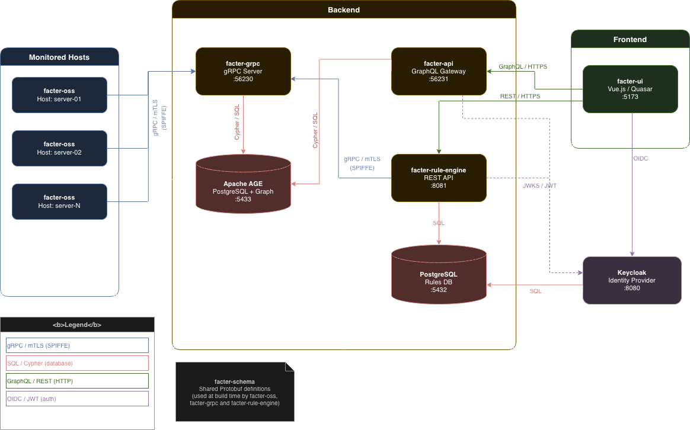

# Facter

**Facter** is an open-source infrastructure intelligence platform that continuously collects, stores and audits facts about your Linux systems — packages, users, processes, SSH keys, network connections, containers, vulnerabilities, and compliance status — and makes them queryable as a graph.

---

## What is Facter?

Facter turns your infrastructure into a **property graph** stored in [Apache AGE](https://age.apache.org/) (PostgreSQL graph extension). Every host, package, user, SSH key, process, and network connection becomes a node in this graph, and their relationships become edges.

Once your infrastructure is in the graph, you can:

- **Query anything** with Cypher (e.g. "which users have sudo access on more than 3 servers?")
- **Write audit rules** in YAML and run them on-demand or on a schedule
- **Visualise compliance** through the web UI with per-rule findings, evidence, and trends
- **Detect drift** with delta inventory updates (only changes are transmitted)

---

## Platform Components

| Component                                              | Role                                                            | Language        |
| ------------------------------------------------------ | --------------------------------------------------------------- | --------------- |
| [facter-oss](components/facter-oss.md)                 | Agent — collects facts from hosts                               | Go              |
| [facter-grpc](components/facter-grpc.md)               | Ingest server — receives facts via gRPC, stores in graph        | Go              |
| [facter-api](components/facter-api.md)                 | Query API — exposes the graph via GraphQL                       | Go              |
| [facter-rule-engine](components/facter-rule-engine.md) | Audit engine — runs Cypher rules, stores findings in PostgreSQL | Go              |
| [facter-ui](components/facter-ui.md)                   | Web interface — dashboards, host drill-down, audit reports      | Vue.js / Quasar |
| [facter-schema](components/facter-schema.md)           | Shared Protobuf contracts for gRPC                              | Proto3          |

---

## Quick Navigation

- :material-clock-fast: **[Getting Started](guides/getting-started.md)**  
  Deploy the full stack in 10 minutes with Docker Compose

- :material-sitemap: **[Architecture](concepts/architecture.md)**  
  Understand how the components communicate

- :material-database: **[Data Model](concepts/data-model.md)**  
  Explore the graph schema

- :material-shield-check: **[Writing Audit Rules](guides/writing-rules.md)**  
  Create your first compliance rule

- :material-cog: **[Configuration Reference](settings/index.md)**  
  All configuration options for every component

- :material-docker: **[Docker Deployment](deployments/docker.md)**  
  Full production-ready Docker Compose setup

---

## Architecture Overview

---

## Key Features

- **Agentless inventory** with a lightweight Go binary (~10 MB)
- **Differential sync**: only changed inventory items are transmitted
- **Graph queries**: full Cypher support over your infrastructure
- **Compliance rules**: YAML-defined audit rules executed as direct Cypher queries against the graph
- **OpenSCAP integration**: CIS benchmark compliance results ingested into the graph
- **Vulnerability matching**: packages cross-referenced with CVE databases
- **mTLS everywhere**: all gRPC communication is mutually authenticated
